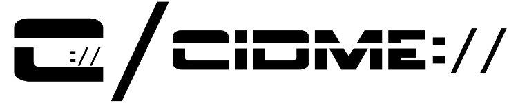
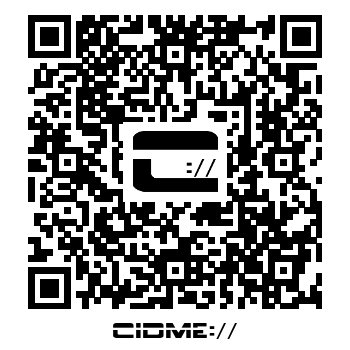

CIDME Core Spec CIDME ID/URL: _cidme://public/EntityContext/7aebda20-dbd5-459e-afab-98842e0aec18_

# CIDME-Core-Spec
CIDME Core Specification

**_NOTE:_** The CIDME Core specification is in internal development and is not ready for release.  However, the the alpha-level vocabulary can be found in the [_gh-pages_ branch of the CIDME/CIDME project](https://github.com/cidme/CIDME/tree/gh-pages).  HTML and JSON files may also be somewhat-navigated by browsing the [CIDME.net website](http://cidme.net).
